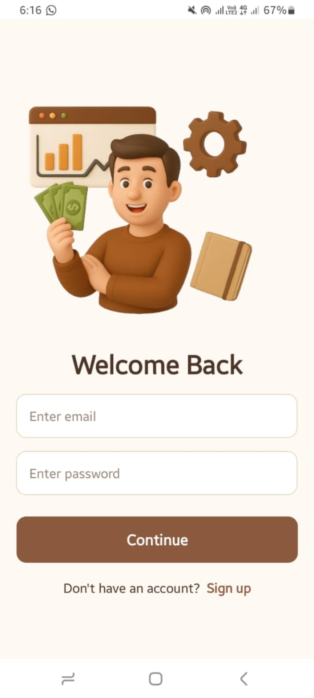
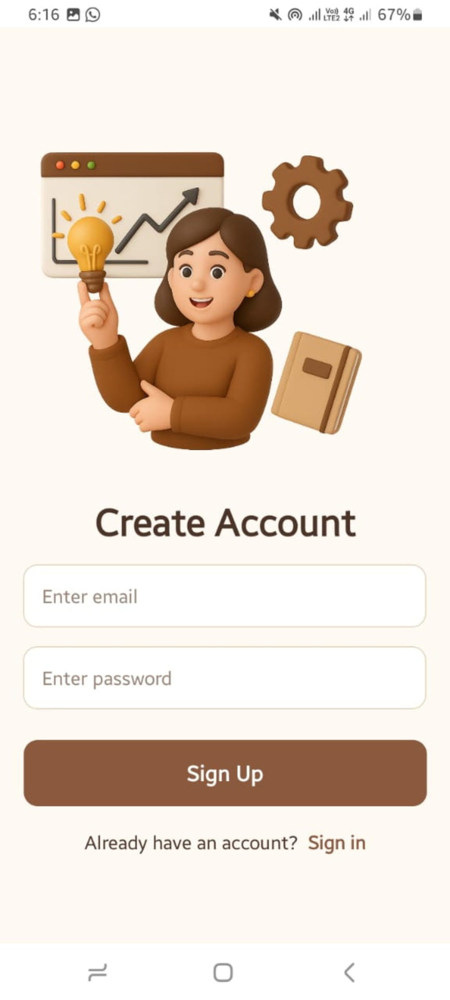

# 💰 BudgetMe – Personal Finance Tracking App

**BudgetMe** is a cross-platform mobile application built with **React Native Expo** that helps users efficiently manage their income and expenses.  
It provides real-time financial insights with a clean, intuitive interface and secure data management.

---

## 🚀 Features
- 📊 Track income and expenses with **automatic balance calculation**  
- 🔐 **Secure authentication** powered by [Clerk.com](https://clerk.com)  
- 🗄️ User-specific data storage using [Neon.tech](https://neon.tech) and [Upstash](https://upstash.com)  
- ⚙️ Backend developed with **JavaScript** and **SQL**, hosted on [Railway](https://railway.com)  
- 🎨 Frontend created using **React Native Expo**, **JavaScript**, and **CSS**  
- 📱 Optimized for a **responsive and smooth user experience**  

---

## 🧠 Tech Stack

| Category | Technologies |
|-----------|---------------|
| **Frontend** | React Native Expo, JavaScript, CSS |
| **Backend** | JavaScript, SQL |
| **Database** | Neon.tech, Upstash |
| **Authentication** | Clerk.com |
| **Hosting** | Railway |

---

## 🖼️ App Screenshots

  
  
  
  

---

## ⚙️ Installation & Setup

Follow these steps to set up the project locally:

1. **Clone the repository**
   git clone https://github.com/zaraakhtar/budgeting-app.git
   
Navigate into the project folder
cd budgeting-app

Install dependencies
npm install

Start the development server
npx expo start

🧾 About the Project
BudgetMe was designed to help users manage their finances effortlessly by keeping track of income, expenses, and balance in real-time.
The app integrates secure authentication, cloud-based data storage, and smooth UI/UX to provide a reliable and pleasant budgeting experience.

👩‍💻 Developed by
**Zara Akhtar**  
📍 Lahore, Pakistan  
🔗 [GitHub Profile](https://github.com/zaraakhtar)
